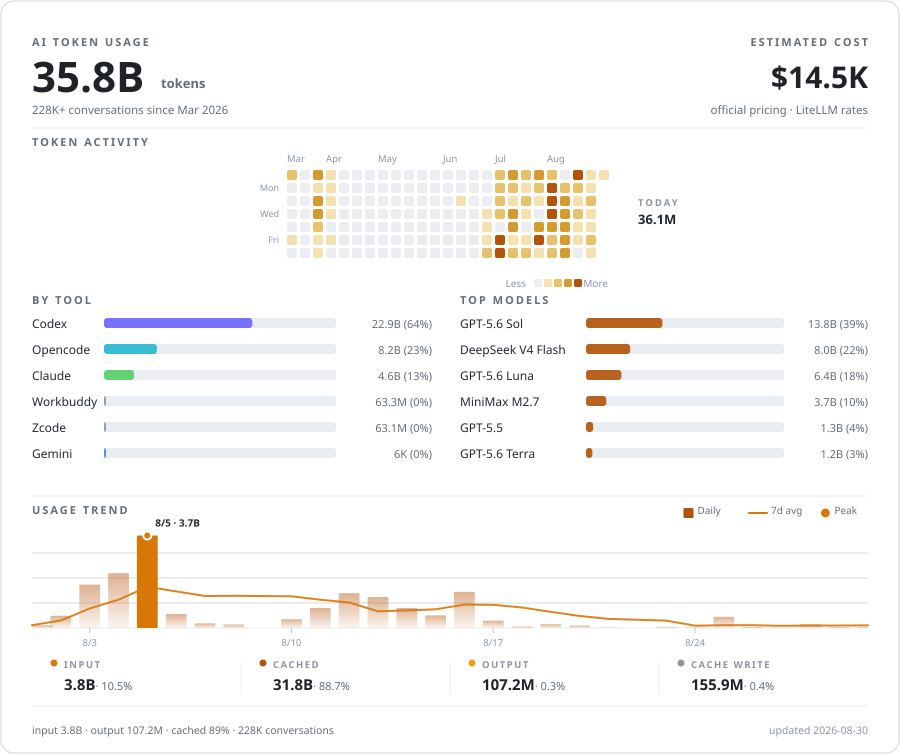

  <a href="README.md">English</a> | <a href="README.zh-CN.md">简体中文</a>

<h1 align="center">Acfufu</h1>

  Building <b>AI-native</b> developer tools. I ship code, and I ship the agents that ship code.

  
  
  
  
  
  

---

## AI Token Usage

  <picture>
    <source media="(prefers-color-scheme: dark)" srcset="token-stats-dark.svg" />
    
  </picture>

  214K+ AI conversations, merged across all tools and models. ~83% cached.

---

## Projects

| Project | What it is | Stack |
| --- | --- | --- |
| [**Radar**](https://github.com/Acfufu/Radar) | Native macOS workspace for Claude Code Radar, Codex Radar & SWE-bench Verified snapshots. | `Swift` · `macOS` |
| [**readme-showcase**](https://github.com/Acfufu/readme-showcase) | Evidence-backed GitHub README design skill for Codex, Claude Code & OpenCode. | `Python` · AI skill |
| [**reach-guard**](https://github.com/Acfufu/reach-guard) | Strict-mode enforcement wrapper for agent-reach: serial lock, pacing, quota, circuit breaker. | `Python` · CLI |
| [**phoenix-cycling-18weapons**](https://github.com/Acfufu/phoenix-cycling-18weapons) | 凤凰兵器骑行 · 十八般武艺. 零依赖单文件网页小游戏（4 模式 × 4 画风 × 程序化国风音频） | `JavaScript` · zero-dep |

---

  <a href="https://github.com/Acfufu">github.com/Acfufu</a> 
  <a href="https://farrell-z.github.io">Farrell-Z.github.io</a>

