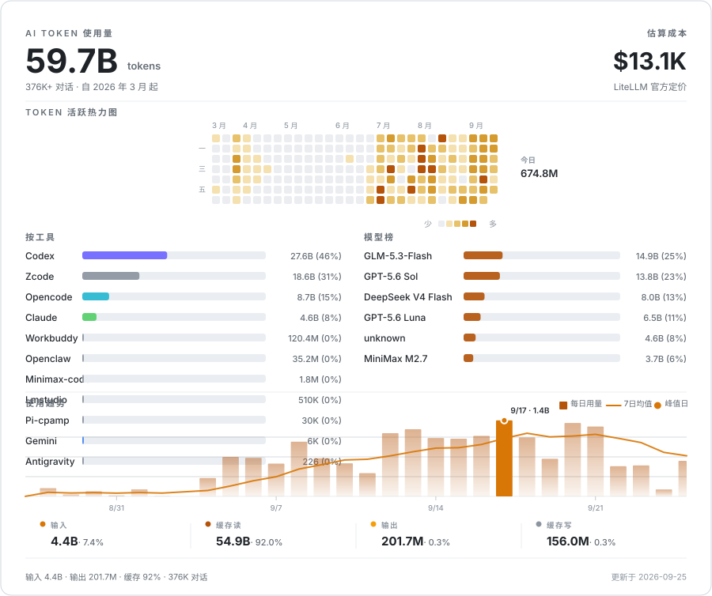

  <a href="README.md">English</a> | <a href="README.zh-CN.md">简体中文</a>

<h1 align="center">Acfufu</h1>

  构建 <b>AI-native</b> 开发者工具。我写代码，也写会写代码的 agent。

  
  
  
  
  
  

---

## AI Token 用量

  <picture>
    <source media="(prefers-color-scheme: dark)" srcset="token-stats-zh-dark.svg" />
    
  </picture>

  214K+ AI 对话，合并自所有工具与模型。缓存约 83%。

---

## 项目

| 项目 | 简介 | 技术栈 |
| --- | --- | --- |
| [**Radar**](https://github.com/Acfufu/Radar) | 面向 Claude Code Radar、Codex Radar 与 SWE-bench Verified 快照的原生 macOS 工作区。 | `Swift` · `macOS` |
| [**readme-showcase**](https://github.com/Acfufu/readme-showcase) | 面向 Codex、Claude Code 与 OpenCode 的实证型 GitHub README 设计技能。 | `Python` · AI skill |
| [**reach-guard**](https://github.com/Acfufu/reach-guard) | agent-reach 的严格模式执行封装：串行锁、节流、配额、熔断器。 | `Python` · CLI |
| [**phoenix-cycling-18weapons**](https://github.com/Acfufu/phoenix-cycling-18weapons) | 凤凰兵器骑行 · 十八般武艺. 零依赖单文件网页小游戏（4 模式 × 4 画风 × 程序化国风音频） | `JavaScript` · zero-dep |

---

  <a href="https://github.com/Acfufu">github.com/Acfufu</a> 
  <a href="https://farrell-z.github.io">Farrell-Z.github.io</a>

