<picture>
  <source media="(prefers-color-scheme: dark)" srcset="assets/profile-zh-dark.svg?v=1790383943">
  <source media="(prefers-color-scheme: light)" srcset="assets/profile-zh-light.svg">
  
</picture>

<picture>
  <source media="(prefers-color-scheme: dark)" srcset="token-stats-zh-dark.svg?v=1790383943">
  <source media="(prefers-color-scheme: light)" srcset="token-stats-zh-light.svg">
  
</picture>

<picture>
  <source media="(prefers-color-scheme: dark)" srcset="assets/wall-zh-dark.svg?v=1790383943">
  <source media="(prefers-color-scheme: light)" srcset="assets/wall-zh-light.svg">
  
</picture>

`→ reach ` [farrell-z.github.io](https://farrell-z.github.io) · [github.com/Acfufu](https://github.com/Acfufu) 
`→ wall  ` [留一句](https://github.com/Acfufu/Acfufu/issues/new?title=wall%7Cyour+message+here&body=1.+Replace+%60your+message+here%60+in+the+title+with+your+message+%28keep+the+%60wall%7C%60+prefix%29.%0A2.+Submit+-+it+appears+on+the+wall+above+within+a+couple+of+minutes+and+the+issue+will+be+closed+automatically.) · 几分钟后就会出现在上面的留言墙上

<!--WALL:START--><!--WALL:END-->
